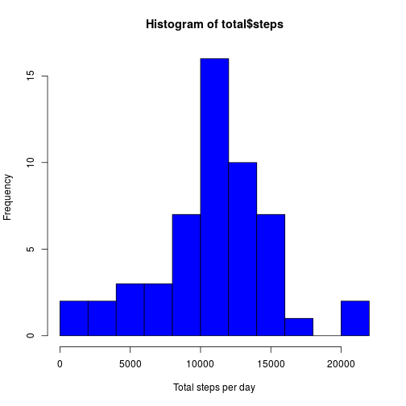
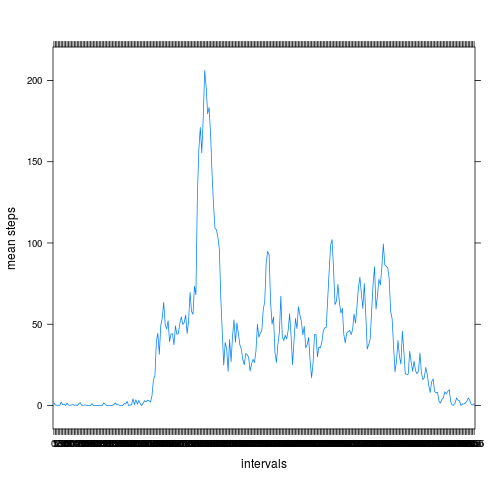
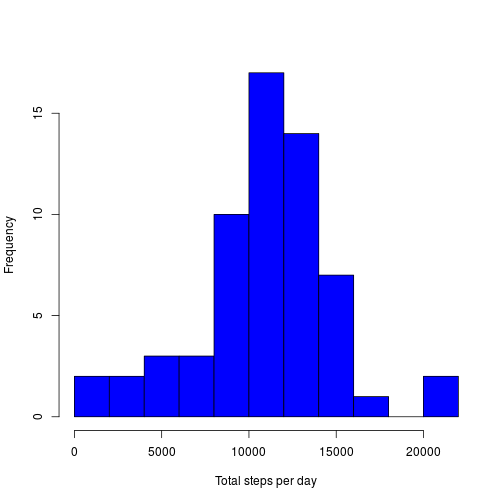
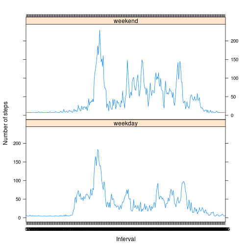

# Reproducible Research: Assignment 1
========================================================

## preprocessing data


```r
library(lubridate)
dataset <- read.csv("./activity.csv")
dataset$data <- as.Date(dataset$date, format="%Y-%m-%d")
dataset$weekday <- wday(dataset$date, label=T,abbr=T)
dataset$weekday <- as.factor(dataset$weekday)
dataset$interval <- as.factor(dataset$interval)
days <- as.factor(dataset$date)
```

## Question 1: What is mean total number of steps taken per day?


```r
total <- aggregate(steps ~ date, dataset, sum)
hist(total$steps, xlab= "Total steps per day", col="blue", breaks = 10)
```

 

mean of steps taken per day


```r
mean(total$steps)
```

```
## [1] 10766
```

median of steps taken per day


```r
median(total$steps)
```

```
## [1] 10765
```

## Question 2: What is the average daily activity pattern?

```r
listaIntervalli <- split(x=dataset,f=dataset$date)
listaIntervalli <- listaIntervalli[[1]]['interval']


library(lattice)
mediaStep <- tapply(dataset$steps, dataset$interval, mean, na.rm=T )


xyplot(mediaStep ~ listaIntervalli,
       type="l",
       ylab="mean steps",
       xlab="intervals",
       las=2,
       par.settings=list(layout.heights=list(top.padding=3, bottom.padding=5)))
```

 

Which 5-minute interval, on average across all the days in the dataset, contains the maximum number of steps?


```r
names(which.max(x=mediaStep))
```

```
## [1] "835"
```

## Question 3: Imputing missing values

Total number of missing values

```r
average <- tapply(dataset$steps, dataset$weekday, mean, na.rm=T )
naElem <- dataset[is.na(dataset$steps),]
length(naElem$steps)   # null values
```

```
## [1] 2304
```

The strategy adopted to fill missing values is to use value's median value

Transform null values with mean value

```r
days <- as.factor(dataset$date)
X <- split(dataset, days)

for(i in 1:length(X))
{
  for(j in 1:length(X[[i]][,'steps']))
  {
    
    if(is.na(X[[i]][j,'steps']))
    {
      
      giorno <- X[[i]][j,'date']
      
      X[[i]][j,'steps'] <- average[wday(giorno)]
    }  
  }
  
}

# unisco il dataset
newdataset <- data.frame(steps={},
                         date={},
                         interval={})
for(i in 1:length(X))
{
  newdataset <- rbind(newdataset, data.frame(steps=X[[i]]['steps'],
                                             date=X[[i]]['date'],
                                             interval=X[[i]]['interval']))
  
}
```

New mean value

```r
tapply(newdataset$steps, dataset$weekday, mean, na.rm=T )
```

```
##   Sun   Mon  Tues   Wed Thurs   Fri   Sat 
## 42.63 34.63 31.07 40.94 28.52 42.92 43.53
```

New median value

```r
tapply(newdataset$steps, dataset$weekday, median, na.rm=T )
```

```
##   Sun   Mon  Tues   Wed Thurs   Fri   Sat 
##     0     0     0     0     0     0     0
```

histogram with new values

```r
total_new <- aggregate(steps ~ date, newdataset, sum)
hist(total_new$steps, xlab= "Total steps per day", main="", col="blue", breaks = 10)
```

 


## Question 4: Are there differences in activity patterns between weekdays and weekends?


```r
# definisco se e weekend o weekday
newdataset['dayTypeInWeek'] = factor(sapply(newdataset$date, function(x){ if (wday(x) == 6 | wday(x) == 7) { "weekend" } else { "weekday"} }))


avgStepdayTypeInWeek = aggregate(steps~interval + dayTypeInWeek, mean, data=newdataset)

library(lattice)
xyplot( steps ~ interval | dayTypeInWeek, data = avgStepdayTypeInWeek, type="l", layout=c(1,2), xlab="Interval", ylab="Number of steps")
```

 
